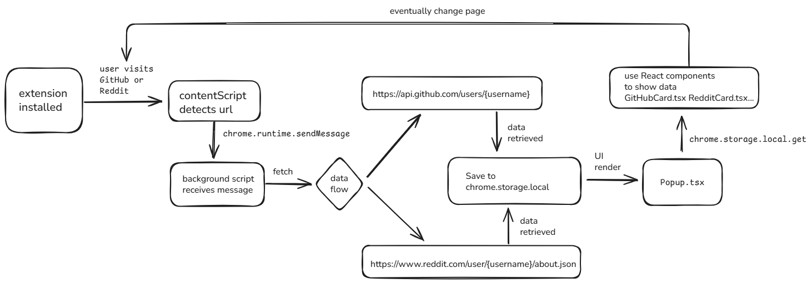

# Dexify – Browser Extension

Dexify is a browser extension that detects if you're viewing a GitHub or Reddit user profile and displays relevant public information using their respective public APIs. But why simply show data when you can see your profile as a Pokemon card, I'm huge fan of Pokemon so I decided to bring a little bit of poke spicy on the extension world. Hope you'll enjoy.

---

## 🔧 Setup Instructions

- Install the extension after cloning the repo
- Simply go to one of the two sites
- If you don't have one, create a profile
- That's it, click on the icon in the extension bar ad a popup should show your data in a pokemon game card style
- you can see generate card also of other profiles

---

## 🌐 Supported Websites

- `github.com` – GitHub user profile pages
- `reddit.com` – Reddit user profile pages

---

## 📦 APIs Used

- [GitHub REST API](https://api.github.com/users/{username})
- [Reddit public JSON endpoint](https://www.reddit.com/user/{username}/about.json)

---

## 💡 Why These Endpoints?

- They are publicly accessible and provide relevant data without authentication.
- The GitHub API offers structured and rich user information.
- Reddit’s `.json` endpoint is easy to consume without needing OAuth.
- I decided to keep it simple and just pick the easiest api I could find and have more "frontend" fun

---

## ⚙️ Key Features

- Detects user profiles on GitHub and Reddit.
- Intercepts the page via a content script and extracts the username.
- Background script fetches user data from the appropriate API.
- Data is stored in `chrome.storage.local`.
- Popup displays the parsed data in a Pokémon-style card.

---

## 🧱 Folder Structure

```
source/
├── Background/          # background.ts (API calls & message handler)
├── ContentScript/       # Extracts username from current URL
├── Popup/               # React + SCSS popup interface
└── icons/               # App icons
```

---

## 🚧 Challenges Faced

- **CORS issues** with Reddit’s API were avoided by directly accessing the `.json` endpoint.
- **Content security policy** restrictions required a careful build setup to avoid use of `eval` or inline scripts.
- Ensuring **reactive updates** to the popup when navigating between supported/unsupported pages.
- **Data management** I decided to use the local storage to mantain data because I wanted a simple way to manage data.

---

## 📈 Future Improvements

- Support for more platforms (e.g., Twitter, LinkedIn).
- Persistent history of visited profiles.
- UX improvements and dark mode.
- Card download

---

## Flow dyagram



Made with ❤️ by Manfredi Rizza
